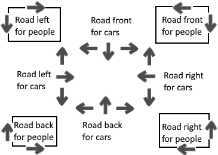
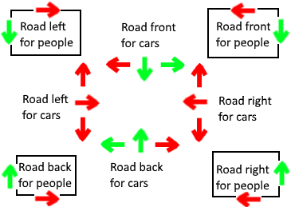
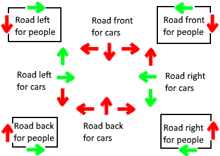
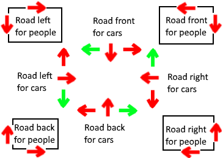

# ParalPr - Task 3 - Crossroad simulator

- **Author:** Juraj Baráth
- **Created at:** 2019 December

## About

Crossroad Simulator is a Java application simulating a certain
real life crossroad situation where the traffic is managed by a 
semaphore system.

#### During the simulation the program prints every single event:
- people generation
- car generation
- semaphore mode switch
- people entering to a road
- cars entering the road

#### After the simulation finishes the program prints the counts of the following:
- Generated people
- Waiting people
- Completed people
- Generated cars
- Waiting cars
- Completed cars

## Road sides and moving directions

The road has 4 sides (represented by the RoadSide enum): **FRONT, RIGHT, BACK, LEFT**

Cars can go to 3 possible directions (represented by the Direction enum):
**LEFT, STRAIGHT, RIGHT**

People can walk in 2 directions: **LEFT** and **RIGHT**

## Semaphore modes

This simulator switches between the following 3 semaphore
modes with a configurable switching time

### Front & Back

### Left & Right

### Right Turn

## Road side occupation
Only the 4 road sides marked as **for cars** on the pictures above can be occupied

People walking left occupies only the roadside which is before their current roadside.

People walking right occupies their own roadside only.
  
Cars always occupies their own roadside and 1 another:

If they go left, than that 1 another is the roadside which is before their current roadside

If they go right, than that 1 another is the roadside which is after their current roadside

If they go straight, than that 1 another is the roadside which is 2x after their current roadside

One roadside can only be occupied by either 1 car or 1 person at a time.

## Configurable options
- **CAR_GENERATION_RATE:** Amount of milliseconds to wait between generating cars

- **CAR_GO_LOOP_DELAY:** Amount of milliseconds to wait before checking if cars
can or can't go from a certain **RoadSide**

- **CAR_GO_TIME:** Amount of milliseconds how long it takes for the car to go
through the road. 
 
- **PEOPLE_WALK_TIME:** Amount of milliseconds how long it takes for a person
to walk through the road.  

- **PEOPLE_WALKER_LOOP_DELAY:** Amount of milliseconds to wait before checking
if people can or can't go from a certain **RoadSide**

- **PERSON_GENERATION_RATE:** Amount of milliseconds to wait between generating people 

- **SEMAPHORE_SWITCH_DELAY:** Amount of milliseconds how often the semaphore
switches between it's modes 

- **SIMULATION_TIME:** Amount of milliseconds how long we would like to simulate
this crossroad process 

